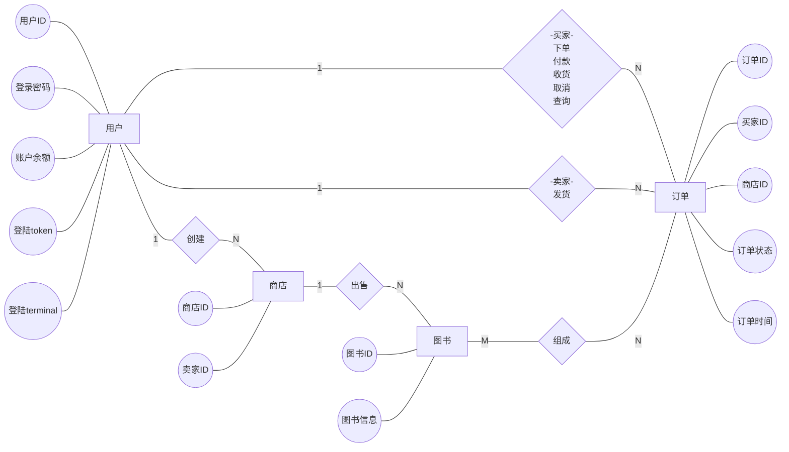
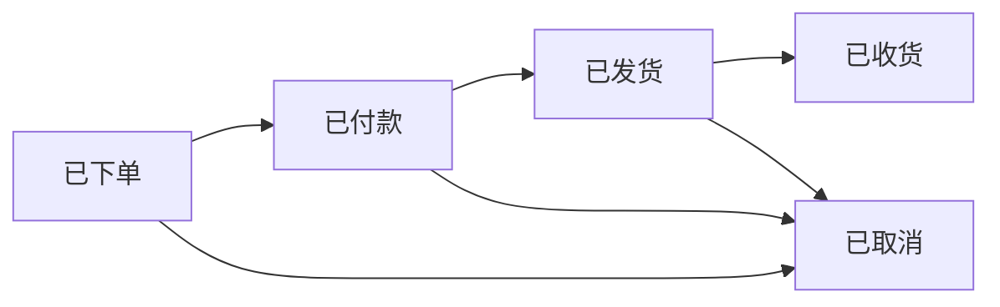
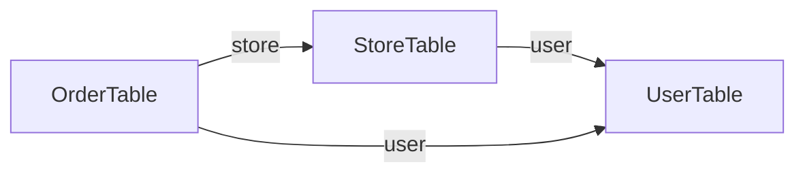
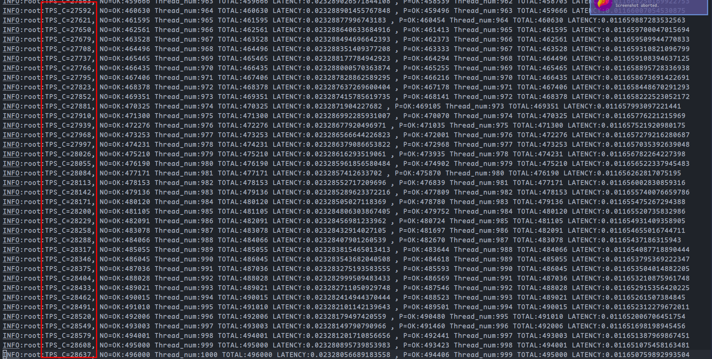
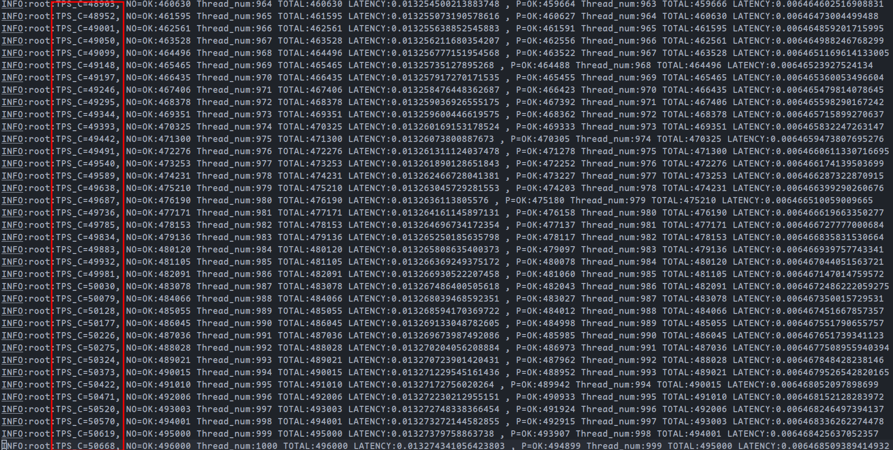
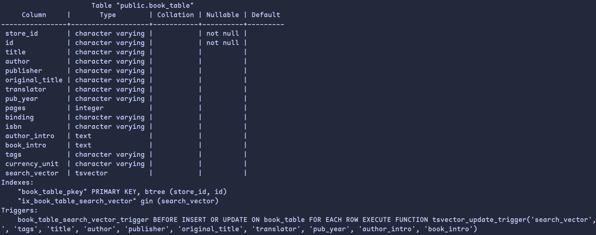
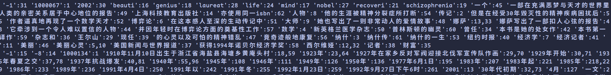
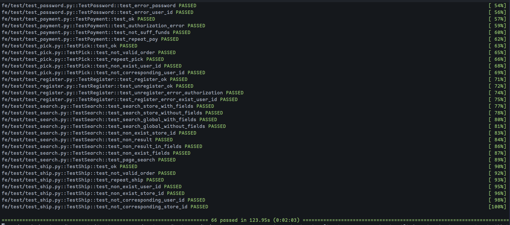
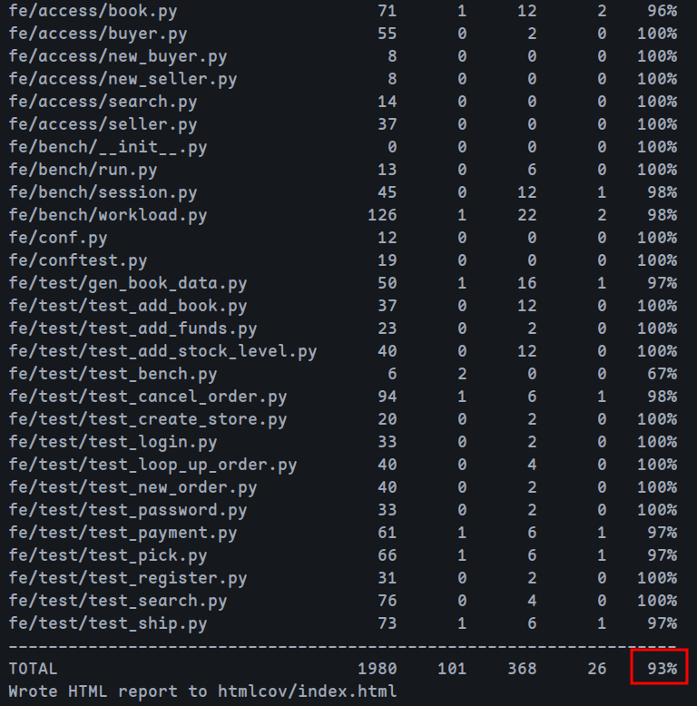
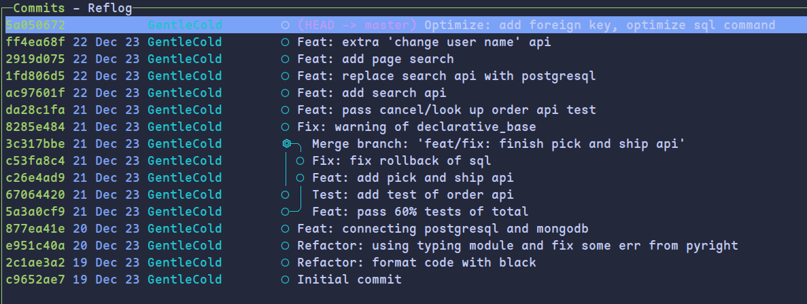

<h1 align="center">Bookstore II</h1>

<div style="text-align: center;">
  <a href="https://www.python.org/" style="display: inline-block;">
    
  </a>
  <a href="https://github.com/psf/black" style="display: inline-block;">
    
  </a>
  <a href="https://www.postgresql.org/" style="display: inline-block;">
    
  </a>
</div>

> 《当代数据管理系统》第二次大作业

[TOC]

## 一、关系型数据库设计

### 1. ER图设计

共四个实体（用户，订单，商店，图书），关系如下：



### 2. 导出关系模式

根据ER图导出关系型schema

#### 实体表

##### user（用户表）

| 变量名          | 类型   | 描述                 | 是否可为空 |
| --------------- | ------ | -------------------- | ---------- |
| user_id（主键） | string | 用户名               | N          |
| user_name       | string | 用户昵称             | N          |
| password        | string | 登录密码             | N          |
| balance         | int    | 账户余额             | N          |
| token           | string | 授权令牌，会定期失效 | Y          |
| terminal        | string | 登陆设备             | Y          |

##### store（商店表)

| 变量名           | 类型   | 描述   | 是否可为空 |
| ---------------- | ------ | ------ | ---------- |
| store_id（主键） | string | 商店id | N          |
| user_id（外键）  | string | 卖户id | N          |

##### order（订单表）

| 变量名           | 类型   | 描述       | 是否可为空 |
| ---------------- | ------ | ---------- | ---------- |
| order_id（主键） | string | 订单id     | N          |
| user_id（外键）  | string | 买家id     | N          |
| store_id（外键） | string | 商店id     | N          |
| state            | int    | 订单状态   | N          |
| time             | float  | 下单时间戳 | N          |

订单状态：0 - 已下单， 1 - 已付款， 2 - 已发货， 3 - 已收货，4 - 已取消

##### book（图书表）

其中store_id和book_id唯一标识一本书，price字段已在关系表中说明，因此可去除，同时为在搜索范围内的字段创建全文索引

| 变量名           | 类型         | 描述            | 是否可为空 |
| ---------------- | ------------ | --------------- | ---------- |
| store_id（主键） | string       | 书籍ID          | N          |
| id（主键）       | string       | 书籍ID          | N          |
| title            | string       | 书籍题目        | N          |
| author           | string       | 作者            | Y          |
| publisher        | string       | 出版社          | Y          |
| original_title   | string       | 原书题目        | Y          |
| translator       | string       | 译者            | Y          |
| pub_year         | string       | 出版年月        | Y          |
| pages            | int          | 页数            | Y          |
| binding          | string       | 装帧，精状/平装 | Y          |
| isbn             | string       | ISBN号          | Y          |
| author_intro     | string       | 作者简介        | Y          |
| book_intro       | string       | 书籍简介        | Y          |
| tags             | array        | 标签            | Y          |
| search_vector    | TSVectorType | 全文索引        | N          |

其中不常用且不在搜索范围内的大块blob数据（图片）和内容(content)分离出来存储于文档型数据库mongodb:

##### book_infos（图书blob数据表）

| 变量名   | 类型   | 描述     | 是否可为空 |
| -------- | ------ | -------- | ---------- |
| store_id | string | 书籍ID   | N          |
| book_id  | string | 书籍ID   | N          |
| pictures | array  | 照片     | Y          |
| content  | string | 样章试读 | Y          |

#### 关系表

##### store_book（商店图书表）

| 变量名      | 类型   | 描述     | 是否可为空 |
| ----------- | ------ | -------- | ---------- |
| store_id    | string | 商店id   | N          |
| book_id     | string | 书本id   | N          |
| stock_level | int    | 书本库存 | N          |

##### order_detail（订单详情表）

| 变量名   | 类型   | 描述     | 是否可为空 |
| -------- | ------ | -------- | ---------- |
| order_id | string | 订单id   | N          |
| book_id  | string | 书本id   | N          |
| count    | int    | 购买数量 | N          |
| price    | int    | 书本单价 | N          |

### 3. 与文档数据库相比的改动

- 由于关系型数据库不具有文档数据库嵌入的特点，所以新增了order_detail表（记录订单的书籍信息）和store_book表（记录商店的库存信息），用于描述实体间的关系，同时在order_detail中冗余price字段以方便查找价格
- 与文档数据库设置unique索引一样，关系数据库设置主键来添加索引
- 另外添加了外键约束，可以减少代码的判断以避免数据的不一致性

### 4. 数据库技术选择

- 在关系型数据库的选择上，使用**postgresql**来存储主要数据，并使用**mongodb**来存储不常用的图片和大段的文字信息
- 操纵数据库的形式上，使用**ORM**来实现（对应python包为sqlalchemy），一方面可以防止sql注入，具有更好的安全性，另一方面符合面向对象的模型，方便代码实现

### 5. 事务处理，约束和索引

- 添加约束和索引，保证数据的一致性和提高查询效率，具体为：

  - 对`user.user_id`添加主键约束和B树索引，因为经常根据`user_id`验证用户信息
  - 对`store.store_id`添加主键约束和B树索引，因为经常根据`store_id`查找对应卖家
  - 对`order.order_id`添加主键约束和B树索引，因为经常根据`order_id`查找订单信息
  - 对`store_book.store_id`和`store_book.book_id`添加主键约束和B树索引，因为经常根据两者查看对应库存
  - 对`order_detail.order_id`和`order_detail.book_id`添加主键约束和B树索引，因为经常根据两者查看订单图书信息
  - 对`book_table`添加`search_vector`字段记录分词结果，并在此之上建立全文索引
  - 对`store_book`添加`stock_level>=0`约束，以减少代码逻辑判断
  - 添加三个外键约束（`store.user_id`, `order.user_id`, `order.store_id`）以减少代码判断，提高效率

- 每次api调用都会开启一个事务，结束时commit事务，保持事务的隔离性
- 添加异常处理来保证事务因约束（如主键冲突）而回滚时程序仍可运行

## 二、接口文档

对外接口函数定义在`be/view/`，接口文档见`doc/`

**前百分之60：**

用户权限接口：[auth](doc/auth.md)

买家接口：[buyer](doc/buyer.md)

卖家接口：[seller](doc/seller.md)

**后百分之40：**

发货与收货接口：[ship_and_pick](doc/ship_and_pick.md)

搜索接口：[search](doc/search.md)

订单查询与取消接口：[order](doc/order.md)

## 三、接口实现

### Auth类

#### 1.auth.register（注册）

**a.后端逻辑**

根据`terminal`和`user_id`生成`token`，向`user`表中插入用户信息（不能重复插入因为`user_id`被设置为主键）

**b.数据库操作**

`user`表中插入用户信息：

```python
new_user = UserTable(
    user_id=user_id,
    user_name=username,
    password=password,
    balance=0,
    token=token,
    terminal=terminal,
)
self.conn.add(new_user)
self.conn.commit()
```

**c.测试用例**

- 正常注册
- 重复注册

#### 2.auth.unregister（注销）

**a.后端逻辑**

检查`password`是否正确，若正确则删除对应的用户信息

**b.数据库操作**

`user`表中删除用户信息：

```python
user = self.conn.query(UserTable).filter_by(user_id=user_id)
if user is None:
    return error.error_authorization_fail()
user.delete()
self.conn.commit()
```

**c.测试用例**

- 正常注销
- 注销错误（错误user_id/错误password）

#### 3.auth.login（登录）

**a.后端逻辑**

检查`password`是否正确，若正确则根据`user_id`和`terminal`生成`token`，更新用户表中`token`与`terminal`信息

**b.数据库操作**

更新用户表中`token`与`terminal`信息：

```python
user = self.conn.query(UserTable).filter_by(user_id=user_id)
if user is None:
    return error.error_authorization_fail() + ("",)
user.update({"token": token, "terminal": terminal})
self.conn.commit()
```

**c.测试用例**

- 正常登录
- 登录错误（错误user_id/错误password）

#### 4.auth.logout（登出）

**a.后端逻辑**

检查`token`是否正确，若正确则根据`user_id`和`terminal`生成`dummy_token`，更新用户表中`token`与`terminal`信息

**b.数据库操作**

更新用户表中`token`与`terminal`信息：

```python
user = self.conn.query(UserTable).filter_by(user_id=user_id)
if user is None:
    return error.error_authorization_fail()
user.update({"token": dummy_token, "terminal": terminal})
self.conn.commit()
```

**c.测试用例**

- 正常登出
- 登出错误（错误user_id/错误password）

#### 5.auth.change_password（修改密码）

**a.后端逻辑**

检查`password`是否正确，若正确则根据`user_id`和`terminal`生成`token`，更新用户表中`password`与`token`与`terminal`信息

**b.数据库操作**

更新用户表中`password`与`token`与`terminal`信息：

```python
user = self.conn.query(UserTable).filter_by(user_id=user_id)
if user is None:
    return error.error_authorization_fail()
user.update(
    {"password": new_password, "token": token, "terminal": terminal}
)
self.conn.commit()
```

**c.测试用例**

- 正常修改密码
- 旧密码错误
- 用户ID错误

### Buyer类

#### 关于订单状态

订单共五个状态，状态与转移关系表示如下



#### 1.buyer.new_order（下单）

**a.后端逻辑**

先检查`user_id`和`store_id`是否存在，若存在则遍历需要购买的图书，对于每种图书，查找对应的库存和价格，如果库存足够（表示可以下单），则减少商家库存（下单时减少库存而不是发货时，如果不减少库存则可以无限下单），并向表`new_order_detail`中插入订单详细信息（图书信息），遍历完成后向表`new_order`插入订单信息，此时的订单状态为0（已下单），同时记录下单时间

**b.数据库操作**

更新订单信息：

```python
order = OrderTable(
    order_id=uid, user_id=user_id, store_id=store_id, state=0, time=now
)
self.conn.add(order)
self.conn.commit()
```

**c.测试用例**

- 下单成功
- 图书不存在
- 图书库存不够
- 买家不存在
- 商店不存在

#### 2.buyer.payment（支付）

**a.后端逻辑**

先检查用户密码是否正确，然后计算用户余额以及订单中商品总价格，验证用户的余额是否足够，如果足够，还要验证此时的下单时间是否超时（根据状态关系易知仅付款时需要验证超时），如果超时，则需要返还商家商品库存，并更新订单状态为4（已取消），如果未超时，则扣除买家余额（不在此时增加商家余额，需要买家收到货才能增加），更新订单状态为1（已付款）

**b.数据库操作**

扣除余额：

```python
order.user.balance -= total_price
```

更新订单状态：

```python
order.state = 1
conn.commit()
```

**c.测试用例**

- 正常支付
- 用户验证错误
- 余额不够
- 重复付款

#### 3.buyer.add_funds（充值）

**a.后端逻辑**

验证用户是否存在，密码是否正确，然后更新用户余额

**b.数据库操作**

更新余额：

```python
# update balance
user.balance += add_value
self.conn.commit()
```

**c.测试用例**

- 正常充值
- 用户密码错误
- 用户ID不存在

#### 4.buyer.pick（收货）

**a.后端逻辑**

先检查`user_id`和`order_id`是否存在，若存在则检查`user_id`是否和订单信息匹配，最后检查订单状态，只有在订单状态为2（已发货）时，才能收货，此时更新订单状态为3（已收货），最后将钱转给卖家

**b.数据库操作**

更新卖家余额

```python
# update seller balance
order.store.user.balance += total_price
self.conn.commit()
```

**c.测试用例**

- 收货成功
- 用户不存在
- 用户不匹配
- 重复收货
- 订单不存在

#### 5.buyer.look_up_order（查询历史订单）

**a.后端逻辑**

先检查`user_id`是否存在，若存在则寻找和`user_id`有关的所有订单信息，从`order_detail`中获取详细信息，最后结构化返回所有订单信息。

**b.数据库操作**

查询订单信息：

```python
details = (
    self.conn.query(
        OrderDetailTable.book_id,
        OrderDetailTable.count,
        OrderDetailTable.price,
    )
    .filter_by(order_id=order_id)
    .all()
)
```

**c.测试用例**

- 查询成功
- 用户不存在

#### 6.buyer.cancel_order（取消订单）

**a.后端逻辑**

先检查`user_id`和`order_id`是否存在，若存在则查看用户是否匹配订单信息，最后检查订单状态，首先如果订单没有处于取消状态或者已收货状态，则可以取消，此时将商品返回给卖家（更新商店库存），再次检查状态，如果为已付款之后的状态，则返还卖家余额。最后更新订单状态为4（已取消）

**b.数据库操作**

查询订单信息：

```python
order = (
    self.conn.query(OrderTable)
    .filter_by(order_id=order_id)
    .options(joinedload(OrderTable.user))  # 加载关联的 UserTable 对象
    .first()
)
```

**c.测试用例**

- 订单取消成功
- 订单在支付后取消
- 订单在发货后取消
- 订单在收货后取消
- 重复取消
- 支付订单但是超时了，再取消订单
- 用户不存在
- 订单不存在
- 用户不匹配订单

### Seller类

#### 1.seller.add_book（添加书籍信息）

**a.后端逻辑**

检测`user_id`，`store_id`,`book_id`是否存在，不存在则返回对应错误，存在则将记录添加至`store_book`中，并分离`pictures`和`content`字段至mongodb

**b.数据库操作**

插入书本信息：

```python
price = book_info.pop("price")
pictures = book_info.pop("pictures")
content = book_info.pop("content")
self.mongo["book"].insert_one(
    {
        "store_id": store_id,
        "book_id": book_id,
        "pictures": pictures,
        "content": content,
    }
)

store = StoreBookTable(
    store_id=store_id, book_id=book_id, price=price, stock_level=stock_level
)
self.conn.add(store)

book_info["store_id"] = store_id
book_info["tags"] = " ".join(book_info["tags"])
self.conn.add(BookTable(**book_info))

self.conn.commit()
```

**c.测试用例**

- 正常添加书籍信息
- 店铺id不存在
- 书本id不存在
- 用户id不存在

#### 2.seller.add_stock_level（添加库存）

**a.后端逻辑**

检测`user_id`，`store_id`,`book_id`是否存在，不存在则返回对应错误，存在则将`store_book`中对应`store_id`和`book_id`的记录的库存`stock_level`更新

**b.数据库操作**

更新书本信息：

```python
self.conn.query(StoreBookTable).filter_by(
    store_id=store_id, book_id=book_id
).update({"stock_level": StoreBookTable.stock_level + add_stock_level})

self.conn.commit()
```

**c.测试用例**

- 正常添加库存
- 用户id错误
- 店铺id错误
- 书籍id错误

#### 3.seller.create_store（创建店铺）

**a.后端逻辑**

检测`user_id`，`store_id`是否存在，不存在则返回对应错误，存在则将`store_id`和`user_id`构建为一条记录添加至数据表`store`中

**b.数据库操作**

创建商店

```python
store = StoreTable(store_id=store_id, user_id=user_id)
self.conn.add(store)
self.conn.commit()
```

**c.测试用例**

- 正常修改密码
- 店铺ID存在

#### 4.seller.ship（发货）

**a.后端逻辑**

先检查`user_id`和`store_id`和`order_id`是否存在，然后检查`user_id`和`store_id`是否匹配订单中信息，最后检查订单状态，仅在状态为1（已付款）时才能发货，更新订单状态为2（已发货）

**b.数据库操作**

更新订单状态：

```python
# 发货，更新状态
order.state = 2
self.conn.commit()
```

**c.测试用例**

- 发货成功
- 订单不存在
- 重复发货
- 用户不存在
- 商店不存在
- 用户不匹配
- 商店不匹配

### Search类

#### 1.search.search

**a.后端逻辑**

传入参数为

```python
def search(
    self,
    key: str,
    store_id: Optional[str],
    fields: Optional[list],
    page_size,
    page_num,
) -> Tuple[int, str, list]:
```

`key`为搜索关键字，`store_id`表示店铺搜索时搜索的店铺，为空则为全站搜索，`fields`表示限制的搜索字段，为空则不限制，page_size和page_num则表示指定的分页大小和页数，默认为None，仅在需要分页结果时传入

首先编写全局查询语句，再检查是否有store_id条件，若有则加上，进行查询，得到结果后，检查是否有fields条件，若有则检查关键词是否在fields内，否则排除，最后检查是否有分页条件，最后返回结构化查询结果（list）

另外使用全文索引加速搜索，详见代码优化部分

支持的fields字段有：

```python
allowed_fields = [
    "id",
    "tags",
    "title",
    "author",
    "publisher",
    "original_title",
    "translator",
    "pub_year",
    "author_intro",
    "book_intro",
]
```

**b.数据库操作**

全站搜索

```python
query = search(select(BookTable), key)
```

店铺搜索

```python
if store_id:
    if not self.store_id_exist(store_id):
        return error.error_non_exist_store_id(store_id) + ([],)
    query = query.filter(BookTable.store_id == store_id)
```

fields检查

```python
if fields:
    if not _check_fields(fields):
        return error.error_invalid_fields() + ([],)
    correspond = False
    for field in fields:
        if key in book_table_dict[field]:
            correspond = True
            break
    if not correspond:
        continue
```

分页搜索

```python
if page_size and page_num:
    query = query.offset(page_num * page_size).limit(page_size)
```

**c.测试用例**

首先在`pre_run_initialization()`中构建测试环境，注册一个买家作为搜索用户（卖家也可），调用`gen_book_data`中的`GenBook.gen`生成书籍数据用于搜索，具体搜索时从生成的数据中取出一些关键字，与键名作为搜索的`value`和`keys`参数，测试项目包括：

- 有field限制的店铺搜索
- 无field限制的店铺搜索
- 有field限制的全站搜索
- 无field限制的全站搜索
- 分页搜索
- 搜索店铺id不存在
- 搜索的field不存在
- 搜索结果为空

## 四、接口扩展

### user.change_user_name（修改用户名）

实际情况中，user_id仅仅用于标识用户，还需要user_name字段来标识用户自己的用户名，所以增加user_name字段，并扩展`change_user_name` api

**a.后端逻辑**

检查`token`是否正确，若正确则修改用户名

**b.数据库操作**

```python
user = self.conn.query(UserTable).filter_by(user_id=user_id)
if user is None:
    return error.error_authorization_fail()
user.update({"user_name": user_name})
self.conn.commit()
```

**c.测试用例**

- 正常修改
- 用户未登陆（错误token）

## 五、代码优化

### 1. 初始代码优化

- 使用black工具对代码进行统一格式化
- 使用pyright作为lsp工具来约束代码规范
- 对于类型注释，使用`typing`模块替换元组表达式
- 剔除无用变量、参数

### 2. sql查询优化

由于经常根据订单数据表找到买家和卖家更新他们的余额

为减少查询，在数据表之间添加relationship关系：

```python
user = relationship("UserTable", backref="stores")
```

总共添加三个relationship关系，从而可以利用正反向查询：



利用joinedload功能提前加载关联对象，从而减少sql查询次数：

```python
order = (
    self.conn.query(OrderTable)
    .filter_by(order_id=order_id)
    .options(joinedload(OrderTable.store).joinedload(StoreTable.user))
    .first()
)
```

另外因为外键约束从而不用额外判断用户是否存在，提高性能

主要优化部分为下单相关api，可以利用吞吐量测试进行性能测试

修改前吞吐量：



在28000左右

修改后吞吐量：



达到了50000

吞吐量提高了约1倍

### 3. 全文索引优化

全文索引可以提升查询速度，在postgresql中，主要用法如下：

- 首先使用to_tsvector将文本转为全文索引向量(会将文本分词)，然后在此之上使用GIN倒排索引来实现高效关键字搜索
- 在搜索时，利用to_tsquery将查询字符串转换为全文搜索查询向量来进行查询

在实际实现中，额外使用了sqlalchemy_searchable包来简化实现，具体实现为：

- 在Book表中添加search_vector字段，用于存储全文索引向量
- 在此字段上添加GIN索引
- 为此字段添加触发器，在更新和插入时更新此字段
- 搜索时，利用包的search模块自动将查询字符串转为向量，并使用GIN索引进行查询

优化后数据表索引信息如下



可见添加了倒排索引，以及相应的触发器

全文分词索引向量如下：



### 4. 数据库参数优化

优化连接数据库时的参数，具体如下：

```python
pool_size=100,    # 连接池大小
pool_recycle=5,   # 连接池重用时间
pool_timeout=10,  # 连接池超时
max_overflow=50   # 连接池溢出
```

## 六、测试结果

### 1. 正确性和覆盖率测试

总共66个测试，全部通过：



测试覆盖率达到93%



### 2. 吞吐率测试

见sql查询优化部分，订单吞吐率达到了50000

## 七、软件工程方法

### 1. 版本控制

使用git作为版本控制工具，对代码进行版本管理，方便回溯

commit历史如下：



### 2. 测试驱动开发

使用pytest进行单元测试，先添加考虑各种情况的测试代码，再编写代码通过测试
