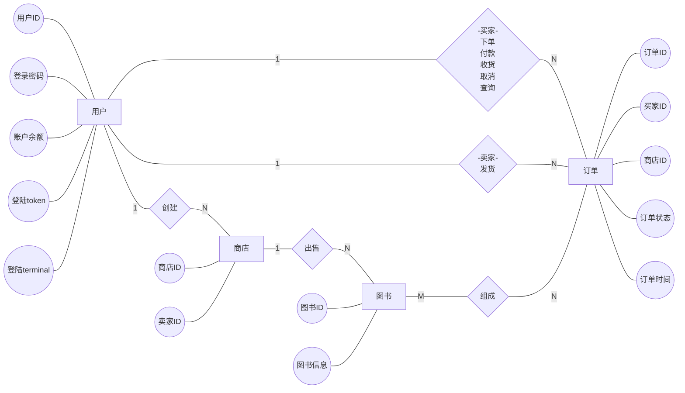

## 项目过程

### 1. 初始代码优化

- 使用black工具对代码进行统一格式化
  [](https://github.com/psf/black)
- 使用pyright作为lsp工具
- 对于类型注释，使用`typing`模块替换元组表达式
- 剔除无用变量、参数

### 2. 设计数据库

## ER图

共四个实体（用户，订单，商店，图书），关系如下：



### 导出关系模式

根据ER图导出关系型schema

##### 实体表

###### user（用户表）

| 变量名          | 类型   | 描述                 | 是否可为空 |
| --------------- | ------ | -------------------- | ---------- |
| user_id（主键） | string | 用户名               | N          |
| password        | string | 登录密码             | N          |
| balance         | int    | 账户余额             | N          |
| token           | string | 授权令牌，会定期失效 | Y          |
| terminal        | string | 登陆设备             | Y          |

###### store（商店表)

| 变量名           | 类型   | 描述   | 是否可为空 |
| ---------------- | ------ | ------ | ---------- |
| store_id（主键） | string | 商店id | N          |
| user_id          | string | 卖户id | N          |

###### order（订单表）

| 变量名           | 类型   | 描述       | 是否可为空 |
| ---------------- | ------ | ---------- | ---------- |
| order_id（主键） | string | 订单id     | N          |
| user_id          | string | 买家id     | N          |
| store_id         | string | 商店id     | N          |
| state            | int    | 订单状态   | N          |
| time             | float  | 下单时间戳 | N          |

订单状态：0 - 已下单， 1 - 已付款， 2 - 已发货， 3 - 已收货，4 - 已取消

###### book（图书表）

图书表使用文档型数据库MongoDB记录：

```json
{
    "tags": [
        "tags1",
        "tags2",
        "tags3",
        "..."
    ],
    "pictures": [
        "$Base 64 encoded bytes array1$",
        "$Base 64 encoded bytes array2$",
        "$Base 64 encoded bytes array3$",
        "..."
    ],
    "id": "$book id$",
    "title": "$book title$",
    "author": "$book author$",
    "publisher": "$book publisher$",
    "original_title": "$original title$",
    "translator": "translater",
    "pub_year": "$pub year$",
    "pages": 10,
    "price": 10,
    "binding": "平装",
    "isbn": "$isbn$",
    "author_intro": "$author introduction$",
    "book_intro": "$book introduction$",
    "content": "$chapter1 ...$"
},
```

为book_id创建索引

##### 关系表

###### store_book（商店图书表）

| 变量名      | 类型   | 描述     | 是否可为空 |
| ----------- | ------ | -------- | ---------- |
| store_id    | string | 商店id   | N          |
| book_id     | string | 书本id   | N          |
| stock_level | int    | 书本库存 | N          |

###### order_detail（订单详情表）

| 变量名   | 类型   | 描述     | 是否可为空 |
| -------- | ------ | -------- | ---------- |
| order_id | string | 订单id   | N          |
| book_id  | string | 书本id   | N          |
| count    | int    | 购买数量 | N          |
| price    | int    | 书本总价 | N          |

使用progresql存储数据，用ORM方法操作数据表
